# Entity Relationship Diagram (Phase 1 schema)

Full schema source: `apps/api/prisma/schema.prisma`.

```mermaid
erDiagram
  USER ||--o{ USER_ROLE : has
  ROLE ||--o{ USER_ROLE : has
  ROLE ||--o{ ROLE_PERMISSION : has
  PERMISSION ||--o{ ROLE_PERMISSION : has
  USER ||--o{ REFRESH_TOKEN : owns
  USER ||--o{ PASSWORD_RESET_TOKEN : owns
  USER ||--o{ ADDRESS : owns
  USER ||--o{ AUDIT_LOG : performs
  USER ||--o{ ORDER : places
  USER ||--o| CART : owns
  USER ||--o| WISHLIST : owns
  USER ||--o{ REVIEW : writes

  CATEGORY ||--o{ CATEGORY : "parent/child"
  CATEGORY ||--o{ PRODUCT_CATEGORY : has
  PRODUCT ||--o{ PRODUCT_CATEGORY : has
  BRAND ||--o{ PRODUCT : has

  PRODUCT ||--o{ PRODUCT_IMAGE : has
  PRODUCT ||--o{ PRODUCT_VIDEO : has
  PRODUCT ||--o{ PRODUCT_VARIANT : has
  PRODUCT ||--o{ PRODUCT_SPECIFICATION : has
  PRODUCT ||--o{ PRODUCT_FAQ : has
  PRODUCT ||--o{ PRODUCT_TAG : has
  TAG ||--o{ PRODUCT_TAG : has
  PRODUCT ||--o{ PRODUCT_RELATION : "related/upsell/cross-sell"
  PRODUCT ||--o| INVENTORY : tracked_by
  PRODUCT_VARIANT ||--o| INVENTORY : tracked_by

  PRODUCT ||--o{ REVIEW : receives
  REVIEW ||--o{ REVIEW_VOTE : has

  CART ||--o{ CART_ITEM : contains
  PRODUCT ||--o{ CART_ITEM : referenced_by
  ORDER ||--o{ ORDER_ITEM : contains
  ORDER ||--o{ ORDER_STATUS_HISTORY : has
  ORDER ||--o| PAYMENT : has
  ORDER ||--o| SHIPMENT : has
  ADDRESS ||--o{ ORDER : ships_to
  COUPON ||--o{ ORDER : applied_to
  COUPON ||--o{ CART : applied_to

  WISHLIST ||--o{ WISHLIST_ITEM : contains
  PRODUCT ||--o{ WISHLIST_ITEM : referenced_by

  FLASH_SALE ||--o{ FLASH_SALE_ITEM : has
  PRODUCT ||--o{ FLASH_SALE_ITEM : discounted_in
  COMBO_DEAL ||--o{ COMBO_ITEM : has
  PRODUCT ||--o{ COMBO_ITEM : part_of

  BLOG_CATEGORY ||--o{ BLOG_POST : has
```

## Notes

- All monetary fields are stored as `Int` in **VND** (no decimal/minor unit).
- `Category` is a self-referencing tree (`parentId`) enabling unlimited nesting for navigation.
- `ProductRelation` uses a `type` enum (`RELATED | UPSELL | CROSS_SELL`) instead of three
  separate join tables — one model, three semantics, easy to query and admin.
- `Inventory` can track either a base `Product` (no variants) or a specific `ProductVariant`
  exclusively (`@unique` on both nullable FKs) — supports simple and variant-based catalogs.
- RBAC uses `Role` → `Permission` many-to-many via `RolePermission`, and `User` → `Role`
  many-to-many via `UserRole`, so a user can hold multiple roles and permission checks are
  data-driven rather than hardcoded.
- `AuditLog.actorId` is nullable + `onDelete: SetNull` so audit history survives user deletion.
- Marketing tables (`Coupon`, `FlashSale*`, `ComboDeal*`, `BuyXGetYRule`, `FreeShippingRule`,
  `Banner`) are modeled now (Phase 1) but their application logic/admin UI ships in Phase 4.
